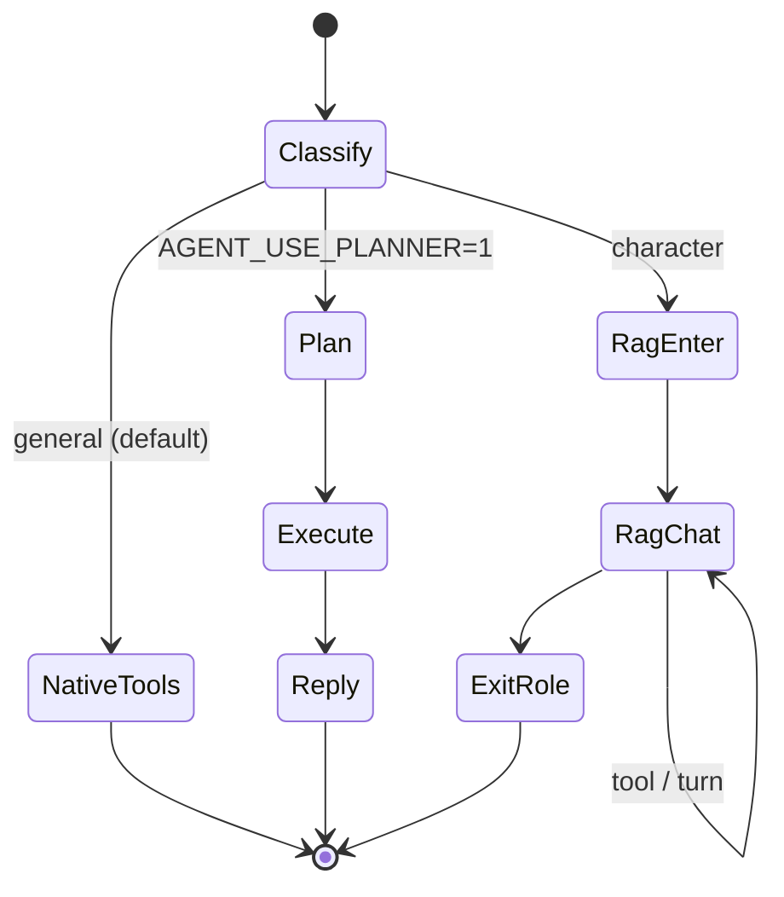

# Agent Conversation Flow

> 同步日期：2026-07-28

## HTTP 入口（摘录）

| Method | Path | Auth | 说明 |
|--------|------|------|------|
| GET | `/api/v1/agent/health/live` | 公开 | 存活探针 |
| GET | `/api/v1/agent/health/ready` | 公开 | 就绪（缺 Token/配置 → 503） |
| POST | `/api/v1/agent/chat[/stream]` | Bearer | 通用助手（默认 native tools） |
| POST | `/api/v1/agent/tools/approve` | Bearer | HITL：批准/拒绝高风险工具 |
| POST | `/api/v1/agent/impersonate/chat[/stream]` | Bearer | 角色扮演 |
| GET | `/api/v1/agent/characters` | Bearer | 角色列表 / 建卡 Job |
| GET/DELETE | `/api/v1/agent/history` | Bearer | 会话历史 |
| GET | `/metrics` | 网络隔离 | Prometheus |

完整契约：`python scripts/export_openapi.py` → `docs/openapi.json`（若已导出）。

## SwarmAgent 状态机

- **classify**：意图 / 是否进入角色模式
- **general（默认）**：`SharedLLMClient.achat_with_tools`；高风险工具经 HITL（`approval_required` SSE）
- **planner 回退**：`AGENT_USE_PLANNER=1` 时 Plan→Execute→Reply
- **character**：`ImpersonationAgent` + `NovelRetrieval`
- **SSE**：`phase` / `plan` / `step_result` / `reply_chunk` / `approval_required` / `done`（含 usage/`cost_usd`）/ `error`

## 会话与预算

- `ConversationService`：**per-session lock**
- 持久化：默认 **SQLite WAL**（`AGENT_SESSION_BACKEND=sqlite`）；可回退 JSON
- Session token 预算：`AGENT_SESSION_TOKEN_BUDGET`；超限 SSE `error`（budget）
- 限流：`AGENT_RATE_LIMIT_RPS` token bucket

## LLM

- 统一 `SharedLLMClient`（timeout / retry / fallback_model / circuit）
- Usage 含 `cost_usd`（`src/shared/llm_pricing.py`）
