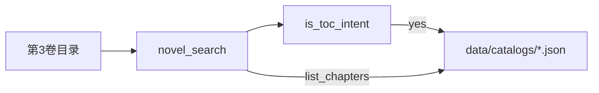

# Agent 工具体系设计

> 同步日期：2026-07-28 | 状态：Current

通用助手（`SwarmAgent` native tools）通过工具覆盖产品模块；控制面 API（审批、健康检查、多轮扮演会话）不做成工具。

## 1. 工具一览

| 工具 | 职责 | 主要 action |
|------|------|-------------|
| `novel_search` | **读**：检索 + 书目 + 章节目录 + 全局问答 | `search` / `list` / `list_chapters` / `import` / `impersonate` / `global`（GraphRAG 社区摘要） |
| `novel_admin` | **写**：书目管理 | `rename_series` / `delete_volume` / `purge_series` / `reindex_flags` |
| `character_kb` | 角色名录 / 建卡 / 合并 | `list` / `candidates` / `get` / `build` / `job_status` / `merge_suggest` / `merge` / `update` |
| `story_analysis` | 关系与事件索引 | `get` / `build` / `job_status`（默认抽 relations+events；伏笔关；Job 含 `progress`；单卷 merge） |
| `web_search` | 公网检索 | query |
| `file_operation` | 工作区文件（禁止当小说库） | read / write / list |
| `execute_code` | 沙箱 Python（默认关） | code |

注册入口：[`src/tools/bootstrap.py`](../src/tools/bootstrap.py) + [`config.yaml`](../config.yaml) `tools.builtin`。

## 2. 为何 `list_chapters` 挂在 `novel_search`

- 章节目录来自 **Novel Catalog sidecar**（真实章名 + order），不是向量语义命中。
- 助手常误用 `search` 查「目录」→ 已加 `is_toc_intent` 短路到 `list_chapters`。
- `list` 返回系列/卷级元数据：`doc_id`、章节数、`block_counts`、`needs_reindex`、是否已在向量库。

选用规则：

```
要目录/章名列表 → list_chapters（或 query「第N卷目录」）
要书目概况      → list
要正文/剧情片段 → search（第N节会映射真实章名）
要改库/删卷     → novel_admin（HITL）
```

## 3. 模块覆盖矩阵

| 产品模块 | 工具 | HITL |
|----------|------|------|
| 四通道 RAG | `novel_search.search` | 否 |
| Catalog 元数据 | `novel_search.list` | 否 |
| 卷内章节目录 | `novel_search.list_chapters` | 否 |
| 简化导入 | `novel_search.import` | 否（后续可迁 admin） |
| 单次模仿 | `novel_search.impersonate` | 否 |
| 系列改名 / 删卷 / purge | `novel_admin.*` | 是（写） |
| 角色名录/建卡/合并 | `character_kb.*` | build/merge/update 是 |
| 剧情分析 | `story_analysis.*` | build 是 |
| 多轮扮演会话 | **非工具**（ImpersonationAgent / API） | — |
| 审批 / health / metrics | **非工具** | — |

## 4. HITL

[`src/shared/tool_approvals.py`](../src/shared/tool_approvals.py)：

- `novel_admin`: `delete_volume` / `purge_series` / `rename_series`
- `character_kb`: `build` / `merge` / `update`
- `story_analysis`: `build`
- 既有：`execute_code`、`file_operation` write

## 5. 反模式

1. 用 `file_operation` 读 `data/novels` 或本地「章节目录」
2. 用 `search` +「目录」做语义检索代替 `list_chapters`
3. 用 `character_kb` 冒充多轮扮演会话
4. 未审批直接删卷 / 合并角色

## 6. 数据流（目录）



## 7. 实现文件

- [`src/tools/builtin_novel.py`](../src/tools/builtin_novel.py)
- [`src/tools/builtin_novel_admin.py`](../src/tools/builtin_novel_admin.py)
- [`src/tools/builtin_character.py`](../src/tools/builtin_character.py)
- [`src/tools/builtin_story.py`](../src/tools/builtin_story.py)
- [`src/application/novel/query_parse.py`](../src/application/novel/query_parse.py)（`is_toc_intent` / 章序解析）
