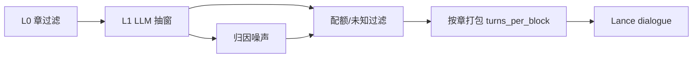
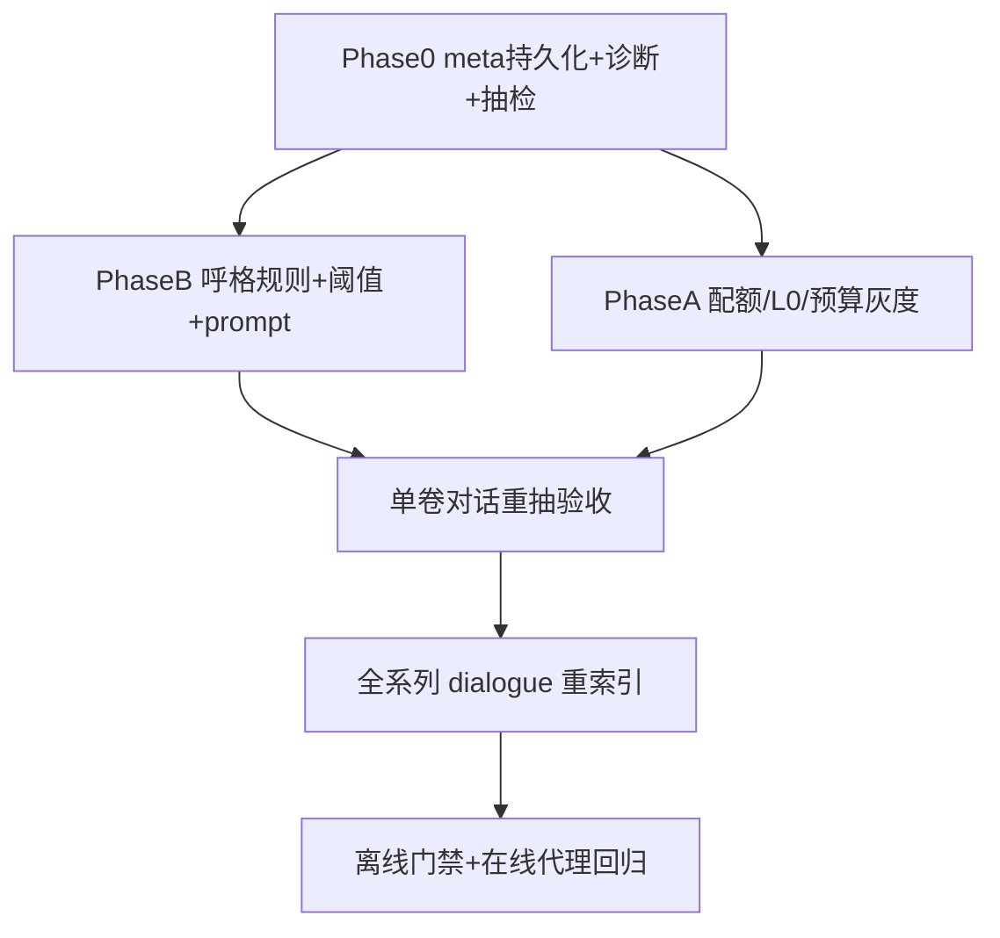

# 对话欠采样 + 归因错误修复设计

> 日期：2026-08-03 | 状态：**Implementing**（Phase 0/A/B 主路径已落地；全库重抽仍需人工触发）  
> 背景：探针显示 15 卷共 ~1281 块，dialogue ≈ **57**（每卷 2–6），且存在「维鲁多拉大人，…」标成说话人「维鲁多拉」一类错绑。  
> 相关：[DIALOGUE_CHAPTER_EXTRACT_DESIGN.md](./DIALOGUE_CHAPTER_EXTRACT_DESIGN.md) · [NARRATIVE_CHILD_PARENT_AND_DIALOGUE_QUOTA_DESIGN.md](./NARRATIVE_CHILD_PARENT_AND_DIALOGUE_QUOTA_DESIGN.md) · [ONLINE_EVAL_DESIGN.md](./ONLINE_EVAL_DESIGN.md) · [DIALOGUE_IMPORTANCE_TIER_CLEANUP_DESIGN.md](./DIALOGUE_IMPORTANCE_TIER_CLEANUP_DESIGN.md)

## 0. 实现进度（2026-08-03）

| 项 | 状态 |
|----|------|
| Phase 0 meta sidecar `data/dialogue_meta/{doc}.json` | Done（ingest 后写入） |
| Phase B 呼格拒绝 / accept_min=0.7 / prompt | Done |
| Phase A 配额 50/40/10、max_calls=80、max_windows=3、引号扩展 | Done（config + 默认） |
| 按 mention TopN 提升 main/supporting（避免全员 extra） | Done（`promote_importance_by_mentions`） |
| 升档净化：别名冲突合并 + 物种黑名单 | See [DIALOGUE_IMPORTANCE_TIER_CLEANUP_DESIGN.md](./DIALOGUE_IMPORTANCE_TIER_CLEANUP_DESIGN.md) |
| 已入库 15 卷 dialogue 重抽 | **Pending**（需按卷重跑 ingest/对话通道；vol01 已试跑） |

## 1. 问题定性

**不要把「dialogue 块少」直接当成「只抽了 57 句台词」。**

当前打包：同章多窗 turns 去重后，按 `turns_per_block=40` 切块（`dialogue_pipeline._turns_to_blocks`）。一章即使有数十句，通常仍只生成 **1 个** dialogue block。narrative ~1224 块来自小粒度切块，与 dialogue **不可横向比块数**。

修复必须同时盯：

| 量 | 含义 |
|----|------|
| `turns` | LLM 抽出的对话轮次 |
| `turns_indexed` | 过配额/未知过滤后入库 |
| `blocks` | 按章打包后的向量块 |
| `per_character` | 角色覆盖与章覆盖 |

扮演/建卡偏弱，可能是 turns 不够，也可能是归因噪声导致样本不可用——两者都要修。

## 2. 现状与根因假设

主路径：`ingest.py` → `dialogue_pipeline`（`cloud_chapter`）→ `dialogue_quota` → 索引。  
配置：`config.yaml` → `novel_rag.dialogue_attribution`（**以实配为准**；配额设计稿 main=100 未落地）。

### 2.1 实配摘要

| 键 | 当前值 | 含义 |
|----|--------|------|
| `mode` | `quota` | 够用即止 |
| `stop_when_priority_met` | `true` | main+supporting 达标可停 |
| `max_calls_per_doc` | `60` | 每卷 LLM 窗上限 |
| `max_windows_per_chapter` | `2` | quota 下每章最多 2 窗 |
| `quotas` | main/supporting/extra = **20/20/20** | 每角色卷累计目标 |
| `min_chapter_coverage_main` | `0.3` | 设计有章覆盖，需验收是否真正拦住早停 |
| `index_unknown` | `false` | 未知不入库 |
| `accept_min` | `0.5` | 置信门槛偏低 |
| `require_quote_marks` | `true` | 无 `「」『』` 则跳章 |
| `turns_per_block` | `40` | 打包粒度 |
| `deepen_max_calls` | `8` | 仅建卡补抽，不补上传全卷 |

### 2.2 欠采样（量）— 优先验证链

1. L0：引号形态/标题黑名单导致 `chapters_skipped` 过高  
2. 预算：`llm_calls` 打满 60 或 `priority_met` 过早停止  
3. 过滤：`turns` 高但 `turns_indexed` 低（`skipped_unknown` / `skipped_quota_full`）  
4. LLM：窗内漏抽或 `max_output_tokens` 截断 → `turns` 本身低  
5. 块数表象：打包粒度放大「块少」观感（验收以 turns 为准）

### 2.3 归因错误（质）— 典型模式

探针：「维鲁多拉大人，…」→ speaker=`维鲁多拉`。属 **呼格/被呼叫方当成说话人**，再经 Roster/alias 敬称剥离与正名合并放大。

机制要点：

- `cloud_chapter` 由 LLM 直接出 speaker（候选 soft）  
- `accept_min=0.5` 放过中等置信错绑  
- `X大人→X` 归一对检索友好，但会把错绑洗成「干净正名」

## 3. Phase 0 — 诊断闸门（先于调参）

### 3.1 持久化 meta（勿只打日志）

每卷写入 sidecar 或 Job payload（建议 `data/.../dialogue_meta.json`），字段沿用现有 `pipe.meta`：

- `chapters_total` / `chapters_skipped` / `skip_reasons` / `skipped_titles`
- `windows` / `llm_calls` / `stopped_reason`
- `turns` / `turns_indexed` / `skipped_unknown` / `skipped_quota_full`
- `unknown` / `per_character` / `conflicts` / `dedupe_dropped`

### 3.2 判定表

| 观察 | 主因 | 下一动作 |
|------|------|----------|
| `no_quotes` 类 skip 主导 | L0 引号过严 | A1 |
| `llm_calls≈60` 且 `stopped_reason=max_calls` | 窗预算不足 | A2 |
| `priority_met` 且章覆盖差 | 早停/配额过低 | A2 |
| `turns` 高、`turns_indexed` 低 | 未知/配额过滤 | A2 + B |
| `turns` 低、`llm_calls` 中等 | LLM 漏抽/截断 | A3 |
| 错绑集中在「X大人/呼格」 | 缺校验层 | B |

### 3.3 人工抽检

每系列 30–50 条 turn（分卷分层），标注 `speaker_ok` 与错误类型：呼格、旁白、串角、未知应拒而未拒。

**未完成 Phase 0 不得全库 `mode: full` 盲重抽。**

## 4. Phase A — 提量

原则：提高 **有效 turns 与角色章覆盖**；不以「dialogue block ≈ narrative block」为 KPI。

### A1. L0 过滤校准

- 扩展引号：在现有 `「」『』` 上覆盖 `“”` / `"` 等可配置 `quote_patterns`  
- 黑名单标题保留；「有引号但标题命中」用独立 skip reason，便于发现误杀  
- 诊断报告附 `skipped_titles` 抽样

### A2. 配额与预算

| 旋钮 | 现状 | 建议方向 |
|------|------|----------|
| `quotas.main` | 20 | 灰度 **50** → 目标 **80–100**（对齐设计稿量级） |
| `quotas.supporting` | 20 | **40–50** |
| `quotas.extra` | 20 | **10–20** 或上传期 0，把预算让给 main |
| `stop_when_priority_met` | true | 保留；**条数满但 `min_chapter_coverage_main` 未达标不得停** |
| `max_calls_per_doc` | 60 | 仅当诊断显示打满再提到 **80–120** |
| `max_windows_per_chapter` | 2 | 超长对话章允许 **3** 或按字数动态 |
| `mode` | quota | 默认 quota；单卷质量回填可用 `full` |

选窗：头/中/尾交织；main 缺口优先调度别名命中章（验收 L1 是否生效）。

### A3. LLM 抽窗

- 监控单窗 turns；有引号却 `turns≈0` → 查 prompt / `max_output_tokens`  
- 确认滑窗不漏引号密集段  
- **禁止**用减小 `turns_per_block` 制造块数繁荣（报告可同时公布 turns 与 blocks）

### A4. 已入库 15 卷重抽

- 按 `doc_id` **只重跑 dialogue 通道**，保留 narrative  
- 替换该 doc 的 dialogue 块，刷新 roster `dialogue_count`  
- 灰度：先 1 卷（建议 vol05）对比 meta + 抽检，再全系列  
- L3 deepen 仍服务建卡；卷级「够用」由上传/重抽主路径负责

### A5. 提量验收 KPI（单卷）

| KPI | 目标 |
|-----|------|
| 有引号章覆盖率 | ≥ 70% 有引号章至少 1 窗 |
| `turns_indexed` | 轻改目标 **≥ 200/卷**，或 main 人均 ≥ 配额 80% |
| main 章覆盖 | 有对话章 ≥ 25–30% 各 ≥1 条 |
| 建卡 | 主角色不再大面积 `low_evidence` |

全库 dialogue **block** 预期升到数百级（随章数），不必追平 1224 narrative。

## 5. Phase B — 纠偏

**重抽必须带上 Phase B**，否则越抽越多错。

### B1. 入库前校验层（轻量规则，非第二套说话人引擎）

LLM 输出 → quota 之前：

1. **呼格拒绝**：台词以「{speaker}」「{speaker}大人/君/…」等强呼格开头 → 标未知或不索引  
2. **旁白拒绝**：无引号叙事宿主句不得进 dialogue  
3. **半硬候选**：Inventory seed 非空时优先映射正名；失败且 conf &lt; `accept_min_strict`（建议 **0.7**）不入库  
4. **敬称剥离只用于归一**：禁止从句首称呼反推 speaker

### B2. Prompt（cloud_chapter）

明确：speaker = **该句引号台词发出者**；禁止把被呼叫方写成 speaker；不确定 → `未知`。

### B3. 置信度与冲突

- 生产 `accept_min` 提到 **0.65–0.7**  
- `conflicts`：同跨冲突宁缺毋错  
- Roster `X大人→X` 保留，但只作用于 **已通过校验** 的 speaker

### B4. 归因验收 KPI

| KPI | 目标 |
|-----|------|
| 人工抽检 speaker 正确率 | ≥ **90%** |
| 呼叫错绑类 | ≈ **0**（探针 vol03/07/11 类样例回归） |
| `unknown` 占比 | 允许上升；&gt;40% 告警回查抽窗 |

## 6. 观测与产品配套

- 持久化 dialogue meta（Phase 0）  
- 探针按 **turn** 统计，不只每卷打印 1 条 block  
- 知识库可选展示「本卷 turns_indexed / 未知率」，避免误判「没抽到」  
- 重抽后：离线 quality gates + [ONLINE_EVAL_DESIGN](./ONLINE_EVAL_DESIGN.md) 生产代理；dialogue case 分数波动属预期

## 7. 明确不做

- 不以 Haruhi / `legacy_window` 作默认主路径  
- 不用 `turns_per_block=1` 刷块数  
- 不用 LLM Judge 当归因修复器  
- 不做 Phase 0 就全库 `full` 重抽

## 8. 落地顺序

## 9. 总成功标准

1. 单卷 turns/覆盖达 A5；不再是「每卷 2–6 个 dialogue 块」的极端欠采样  
2. 呼叫错绑在抽检中消失；speaker 正确率 ≥90%  
3. 主角色建卡 `low_evidence` 显著下降；dialogue 检索不再近空  
4. meta 可查，后续调参有据可依

## 10. 文档索引

| 文档 | 角色 |
|------|------|
| 本文 | 欠采样 + 归因修复唯一说明 |
| DIALOGUE_CHAPTER_EXTRACT_DESIGN | 按章抽取主路径 |
| NARRATIVE_CHILD_PARENT_AND_DIALOGUE_QUOTA_DESIGN | 配额四层 L0–L3（设计量级） |
| config.yaml `dialogue_attribution` | 运行实配 |
| ONLINE_EVAL_DESIGN | 重抽后质量回归 |
