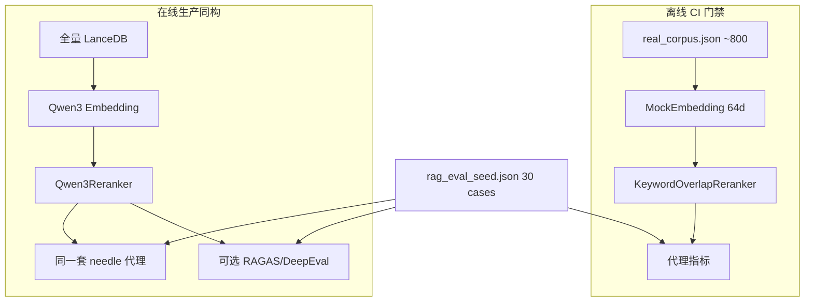
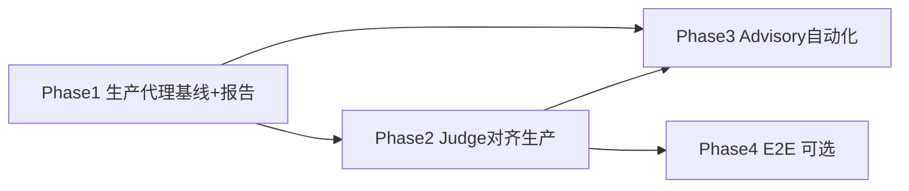

# 在线评估设计（生产同构 + LLM Judge）

> 日期：2026-08-03 | 状态：**Superseded（2026-08-06）**——对话检索评估已由 [DIALOGUE_RETRIEVAL_EVAL_DESIGN.md](./DIALOGUE_RETRIEVAL_EVAL_DESIGN.md) 取代（旧 `tests/eval/` 已删、不恢复；新入口 `scripts/dev/eval_dialogue/`）；本文其余部分存档参考。 | 范围：**不写实现代码**；实现按 §9 分阶段推进  
> 相关：[NOVEL_RAG_DESIGN.md](./NOVEL_RAG_DESIGN.md) · [EVAL_LLM_JUDGE.md](./EVAL_LLM_JUDGE.md) · [RERANKER.md](./RERANKER.md)

## 1. 术语与分层

本仓库「在线评估」= 相对 **CI 离线代理门禁** 的 **生产同构评测**，不是真实用户流量影子评测。

| 层 | 入口（现状） | 索引 | 嵌入 / 精排 | 指标 | 挡 PR？ |
|----|--------------|------|-------------|------|---------|
| 离线代理 | `tests/eval/test_quality_gates.py` | `real_corpus.json` ~800 块 FAISS | MockEmbedding + KeywordOverlapReranker | 代理四指标（严谨门槛） | **是** |
| 生产管道代理（在线轨 A） | `scripts/dev/eval_real_retrieval.py` | 全量 `./data/novel_lance` | Qwen3 Embedding + Qwen3Reranker | **同一套**代理公式 | 否 |
| LLM Judge（在线轨 B） | `test_ragas_deepeval_optional.py` + 脚本可选段 | 夹具或生产命中 | 多数仍 Mock；脚本可走生产 | RAGAS / DeepEval | 否 |



**结论**：离线门槛已收紧为质量目标；缺口是 **生产同构基线制度化** 与 **Judge 打在生产检索结果上**，不是再发明第三套指标名。

## 2. 要回答的问题

1. Mock + keyword + 800 夹具上 90%+，能否代表 Qwen3 + 全量 Lance 的真实检索？
2. `must_include_any` / `block_type` 重叠，与 LLM 语境精准度是否同向？
3. embedding / reranker / ingest / 路由变更后，生产指标是否掉，而不只是 CI 绿？
4. GPU 权重 + DeepSeek token 如何按场景开关，避免烧在每条 PR 上？

---

## 3. Phase 1 — 生产管道代理制度化

### 3.1 目标

把「手跑一次脚本」变成 **可复现、可 diff 的基线报告**：固定命令、环境指纹、与离线分数并列表。

### 3.2 轨 A 指标（与离线同源公式）

复用 `tests/eval/quality_metrics.py` / `eval_real_retrieval.run_offline`：

| 指标 | 定义 |
|------|------|
| `context_precision` | 渲染 context 含任一 `must_include_any` |
| `faithfulness_proxy` | 命中块 `block_type ∩ expected_channels` 非空 |
| `channel_overlap` | IntentRouter 通道与 `expected_channels` 重叠 |
| `hit_at_k` | raw hits（k=5）文本含 needle |

用途：与离线分数并列表，量化 **夹具乐观偏差** = `offline_ci − online_prod`（正差 = 夹具偏乐观）。

### 3.3 语料与评估集

| 资产 | 离线 | 在线（Phase 1） |
|------|------|-----------------|
| 索引 | 800 块夹具 FAISS | 本机/评测机全量 LanceDB（vol01–15，约 1281 块） |
| Case | `rag_eval_seed.json` 30 条 | **同源**；禁止另维护「只对生产」的私有 seed |
| 通道 | narrative + dialogue | 同；qa/character 未入库则不进 expected |
| Gold | `must_include_any` 子串 | 保留 |

**预期**：全量索引干扰块更多 → 在线 Hit@K / context_precision **通常 ≤ 离线**。这是信号，不是失败。

### 3.4 报告契约（每次在线跑必须产出）

建议落盘目录（实现时）：`docs/analysis/online_eval/` 或 `artifacts/online_eval/`，文件名带日期与 git short sha。

报告最小字段：

1. **汇总表**：四代理指标；对照「上次离线跑分」与各自阈值段  
2. **差距**：`offline_ci − online_prod` 逐指标  
3. **失败 case**：`ctx_hit=0` 或 `hitk=0` 的 id、query、top-3 `global_id` + `block_type`  
4. **分通道切片**：narrative vs dialogue case 分别汇总（dialogue 全库约 57 块，方差大）  
5. **环境指纹**：

| 字段 | 示例来源 |
|------|----------|
| `git_sha` | `git rev-parse --short HEAD` |
| `embedding` | 类名 / 模型路径 |
| `reranker` | 类名 / provider / top_n |
| `lance_path` | `./data/novel_lance` |
| `doc_count` / `block_count` | store API |
| `seed_version` | `rag_eval_seed.json` version |
| `fixture_note` | 离线对照所用夹具 version / block 数 |
| `timestamp` | ISO8601 |

### 3.5 运行场景（Phase 1）

| 场景 | 触发 | 跑什么 | 失败策略 |
|------|------|--------|----------|
| PR | 每次 | 仅离线严谨门槛 | **阻断** |
| 本地 / 发布前 | 手动 | `python scripts/dev/eval_real_retrieval.py` 轨 A | 人工读报告 |
| 权重 / ingest 大改 | 强制 | 轨 A | 与上次基线 diff |

### 3.6 在线轨 A 阈值草案（分轨，不套用离线）

`thresholds.json` **设计态**新增段（实现时写入；数值须先实测再冻结）：

```json
"online_prod": {
  "description": "Production-isomorphic proxy floors. Set after 1–2 measured baselines; typically 5–10pp below measured online mean, and expected below offline minima.",
  "context_precision": { "minimum": null },
  "faithfulness_proxy": { "minimum": null },
  "channel_overlap": { "minimum": null },
  "hit_at_k": { "minimum_ratio": null }
}
```

规则：

- **禁止**把离线 `0.80 / 0.75 / 0.85 / 0.80` 直接拷到 `online_prod`
- 先跑 ≥2 次稳定环境，取均值；门槛 = 均值 − 5～10pp，且不低于「明显崩溃」地板（建议不低于 0.50）
- 在线轨 A **默认不挡 PR**；未填 `minimum` 前只出报告、不做 assert

### 3.7 Phase 1 完成定义

- [ ] 约定报告路径与指纹字段（上文 §3.4）  
- [ ] 至少 1 次全量 Lance + Qwen3 轨 A 报告落盘，并写出与离线的差距表  
- [ ] `online_prod` 阈值段有实测草案（可仍为 advisory）

---

## 4. Phase 2 — LLM Judge 绑定生产命中

### 4.1 目标

轨 B 的输入必须是 **生产检索命中 contexts**，不是 synthetic 单条玩具 case；并与轨 A **逐 case 对照**。

### 4.2 拆清 Retrieval vs Answer

| 模式 | 评什么 | `answer` 字段 | 阶段 |
|------|--------|---------------|------|
| **Retrieval-only judge** | question + retrieved contexts（+ gold） | **不使用**生成答案；或显式置空 / 占位且不计入 faithfulness | Phase 2 |
| **E2E judge** | Agent / impersonation 最终回答 | 真实模型输出 | Phase 4 |

**反模式（现状脚本风险）**：用 `context[:500]` 冒充 `answer` → 高估 faithfulness，混淆检索质量与生成质量。Phase 2 实现时必须停止该做法。

### 4.3 轨 B 指标

沿用 `thresholds.json` → `llm_judge`（当前 faithfulness / context_precision 0.6，answer_relevancy 0.5）：

| 指标 | 来源 | Phase 2 |
|------|------|---------|
| `context_precision` | RAGAS | **必跑**（对生产 contexts） |
| `faithfulness` | DeepEval / RAGAS | **必跑**，但仅当存在独立 `answer`；Retrieval-only 阶段可跳过或改用「上下文是否支撑 gold」类指标 |
| `answer_relevancy` | RAGAS / DeepEval | Phase 2 **不跑**（留给 Phase 4） |

Judge 阈值可略低于代理（裁判噪声大）；**不挡 merge**。

### 4.4 与轨 A 的对照输出

每条 case 至少：

| case_id | proxy_ctx | proxy_hitk | llm_ctx_prec | 一致？ |
|---------|-----------|------------|--------------|--------|
| … | 0/1 | 0/1 | 0–1 | 同向 / 分歧 |

分歧 case 单独列表：代理过、Judge 不过（或相反）→ 用于校准 needle gold 或发现语义假阳性。

现状参考：`test_llm_judge_vs_offline_on_real_corpus` 已有「夹具 + Mock」对照雏形；Phase 2 目标是同一对照逻辑换 **生产 retrieval**。

### 4.5 Phase 2 完成定义

- [ ] Judge 输入 = 生产 top-k 块文本  
- [ ] 禁止 context 冒充 answer  
- [ ] 逐 case 代理 vs Judge 对照表进报告  
- [ ] `EVAL_LLM_JUDGE=1` 文档说明：夹具 smoke vs 生产对照两条路径

---

## 5. Phase 3 — Advisory 自动化 + 阈值分轨

### 5.1 目标

Nightly / `workflow_dispatch` 产出 artifact；回归告警；**仍不阻断 PR**。

### 5.2 触发矩阵

| 场景 | 触发 | 轨 A | 轨 B | Runner |
|------|------|------|------|--------|
| PR | push/PR | 否（只跑离线） | 否 | GitHub-hosted |
| LLM Judge smoke | 现有 `eval-llm-judge.yml` | 否 | 夹具/synthetic（现状） | ubuntu-latest + secret |
| 在线生产评测 | 新建或扩展 workflow / 本地 cron | **是** | 有 key 则跑 | **自托管 GPU** 或本地；需 Lance 数据卷 + 模型权重 |
| 大改强制 | 人工 checklist | 是 | 建议 | 同上 |

GitHub-hosted 无 GPU / 无全量 Lance → **不能**把生产轨 A 塞进默认 Python CI。

### 5.3 阈值分轨（文件契约）

`tests/eval/thresholds.json` 三段并行：

| 段 | 用途 | 挡 PR |
|----|------|-------|
| `offline` | CI 夹具代理（已严谨） | 是 |
| `online_prod` | 生产同构代理（Phase 1 实测后填） | 否（assert 仅在 advisory job） |
| `llm_judge` | RAGAS/DeepEval | 否 |

Advisory job 失败策略：workflow **结论可为 success + 注释/issue/artifact 标红**，或 `continue-on-error`；禁止 `required check` 绑到生产轨。

### 5.4 Artifact

- 报告 JSON/Markdown（§3.4）  
- 可选：与 `baseline/online_prod_latest.json` diff（指标跌超阈值或跌超 5pp → 告警）

### 5.5 Phase 3 完成定义

- [ ] `online_prod` 段有非 null 门槛  
- [ ] 可手动触发的 advisory workflow（或文档化的本机 cron）跑通轨 A  
- [ ] 有 key 时轨 B 可选；产物可下载  
- [ ] PR required checks **不含**该 job

---

## 6. Phase 4（可选）— Agent 最终回答 E2E Judge

### 6.1 目标

在检索轨之外，对 **impersonation / 通用 Agent 最终回答** 评：

- `faithfulness`（相对 retrieved context）  
- `answer_relevancy`（相对 question）  
- （可选）人设一致性——超出 RAGAS 默认指标，需自建 rubric

### 6.2 与检索轨分离

| 门槛空间 | 内容 |
|----------|------|
| 检索质量 | 轨 A + Retrieval-only 轨 B |
| 生成质量 | E2E judge；**独立阈值段** 如 `llm_judge_e2e` |

禁止用 E2E 分数解释「检索是否回归」，也禁止用 Hit@K 解释「角色口吻是否像」。

### 6.3 成本与抽样

- 默认不对 30 条全量每条都生成完整 Agent 回复；可先 **固定子集（如 10 条）** 或按通道分层抽  
- 温度 0；固定 seed；报告写入 model name / prompt 版本指纹

### 6.4 Phase 4 完成定义

- [ ] 独立入口与阈值段  
- [ ] 与检索报告分文件或分 section  
- [ ] 仍不挡 PR

---

## 7. 现状缺口（设计对照）

| # | 缺口 | 对应阶段 |
|---|------|----------|
| 1 | 生产评估仅在 `scripts/dev/`，无版本化报告 / 基线约定 | Phase 1 |
| 2 | optional pytest 仍 Mock + synthetic；生产对照弱 | Phase 2 |
| 3 | `context[:500]` 当 answer，Judge 解释力差 | Phase 2 |
| 4 | `thresholds.json` 无 `online_prod` | Phase 1→3 |
| 5 | CI 默认无法跑 Qwen3 + 全量 Lance | Phase 3（自托管/本地） |
| 6 | dialogue 稀疏，缺分通道切片 | Phase 1 报告 |

## 8. 明确不做（本期设计边界）

- 真实用户流量抽样 / 影子流量评测  
- 将 LLM Judge 或在线轨 A 设为 PR merge 阻断  
- 为在线单独维护第二套 seed（先榨干同源 30 条对比价值）  
- 在无 GPU 的 GitHub-hosted runner 上强行跑 Qwen3

## 9. 落地顺序与依赖



1. **先代理后 Judge**：无 Phase 1 基线前不烧 token  
2. **同一 seed，分层裁判**：离线拦回归，在线量真实，Judge 做语义校准  
3. **在线默认不挡 PR**；阈值分轨  
4. **报告可 diff**：否则「跑过」无工程价值

## 10. 设计原则（拍板）

- 同一 `rag_eval_seed.json`，离线 / 在线 / Judge 三层裁判  
- 在线阈值独立于离线严谨门槛  
- Retrieval-only 与 E2E 分离  
- 成本：PR → 离线；发布/Nightly → 轨 A；有 key → 轨 B；E2E 抽样

## 11. 文档与入口索引

| 文档 / 入口 | 角色 |
|-------------|------|
| 本文 | 在线评估设计唯一说明 |
| [EVAL_LLM_JUDGE.md](./EVAL_LLM_JUDGE.md) | 轨 B 开关与依赖 |
| [NOVEL_RAG_DESIGN.md](./NOVEL_RAG_DESIGN.md) | 离线门禁与管道 |
| `scripts/dev/eval_real_retrieval.py` | 轨 A（及可选轨 B）手跑入口 |
| `tests/eval/test_quality_gates.py` | 离线 PR 门禁 |
| `tests/eval/thresholds.json` | `offline` / 未来 `online_prod` / `llm_judge` |
